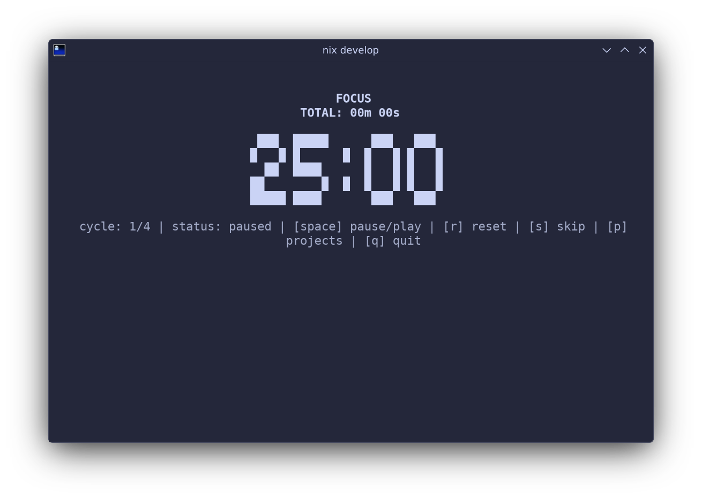
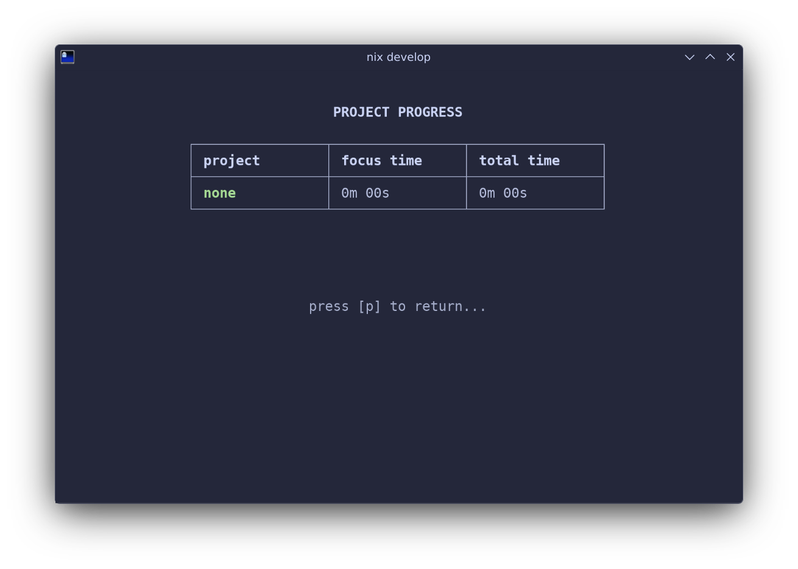

A small, terminal-based Pomodoro timer focused on simple workflows and per-project time tracking.

# Screenshots





# CLI Usage

Run the compiled binary or via `cargo run --release -- [OPTIONS]`.

Options:

- `-f, --focus <minutes>` — Focus time in minutes (default: 25)
- `-b, --break-time <minutes>` — Short break in minutes (default: 5)
- `-l, --long-break <minutes>` — Long break in minutes (default: 15)
- `-c, --cycles <n>` — Number of work/break cycles before a long break (default: 4)
- `-p, --project <name>` — Associate this session with a project (created if missing)

Examples:

```bash
# Run with defaults
cargo run --release --

# Start with a 50/10 focus/break schedule for project "Work"
cargo run --release -- -f 50 -b 10 -l 20 -c 3 -p Work
```

# Controls (while running)

- Space: Start / Pause timer
- `r`: Reset current timer
- `s`: Skip to next period
- `p`: Toggle project list view
- `q` or `Esc`: Quit (saves current project)
- `Ctrl+C` or `Ctrl+X`: Quit immediately (saves current project)

# Data & Config

The app stores configuration and projects in a SQLite database under your platform config directory (e.g. `~/.config/pomodoro/database.db`). Defaults are created on first run:

- Focus: 25 minutes
- Break: 5 minutes
- Long break: 15 minutes
- Cycles: 4

# Notes

- Projects are persisted between runs. Providing `--project NAME` at startup selects or creates that project for the session.
- The UI is terminal-based and keyboard-driven.
